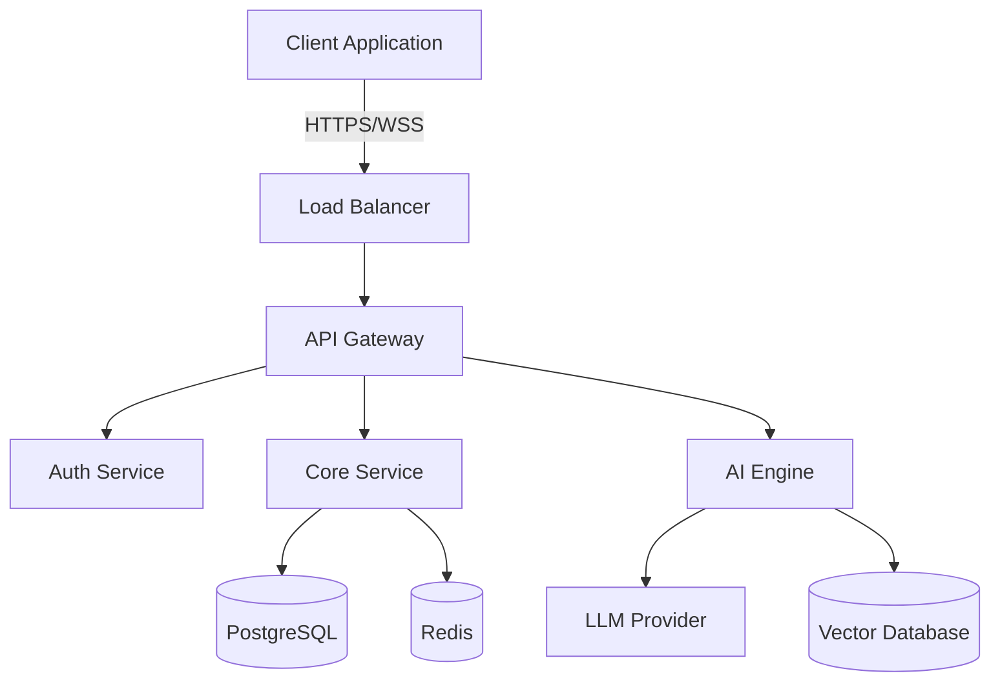
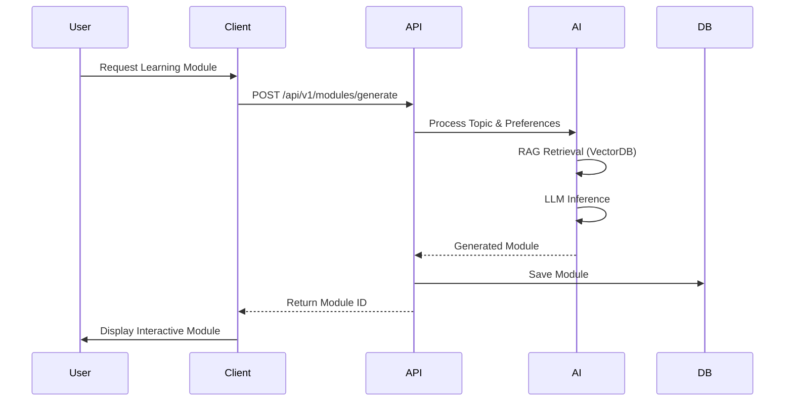

# System Architecture

Gurwi's architecture is designed for scalability, real-time collaboration, and high-performance AI inference.

## High-Level Overview

## Data Flow

The following sequence diagram illustrates how a user request is processed when generating a new product plan.

